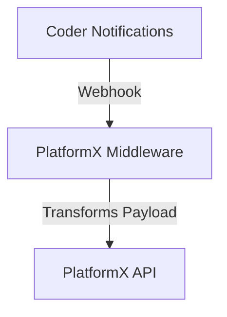

# Coder PlatformX Events Middleware

## Overview

This sample middleware transforms Coder notification payloads into PlatformX-compatible payloads and forwards them to [PlatformX by getDX](https://getdx.com/platformx) for tracking. It is optimized for serverless platforms such as AWS Lambda and Google Cloud Run but may require modifications to fit your organization's needs.

> [!Note]: This is a sample implementation. Adaptations in other languages and frameworks are possible.

## Features

- Receives webhooks from Coder
- Filters tracked events based on environment configuration
- Converts Coder payloads into PlatformX-compatible format
- Forwards formatted events to PlatformX by getDX API
- Logs requests and responses for debugging

## Requirements

- Python 3.x
- Flask
- Requests
- Python-dotenv

## Installation

1. Clone the repository:
   ```sh
   git clone <repo-url>
   cd <repo-directory>
   ```
2. Install dependencies:
   ```sh
   pip install -r requirements.txt
   ```

## How It Works

Coder sends event notifications via webhooks to this middleware, which processes and reformats the payload into a structure compatible with [PlatformX by getDX](https://help.getdx.com/en/articles/7880779-getting-started). The transformed payload is then forwarded to PlatformX for further processing and analysis.



## Supported Notification Types

This middleware supports the following [Coder notifications](https://coder.com/docs/admin/monitoring/notifications):

- Workspace Created
- Workspace Manually Updated
- User Account Created
- User Account Suspended
- User Account Activated

## Environment Variables

Create a `.env` file in the project root and set the following variables:

```ini
LOG_LEVEL=INFO  # Options: DEBUG, INFO, WARNING
GETDX_API_KEY=<your-getdx-api-key>
EVENTS_TRACKED=Workspace Created,Workspace Manually Updated,User Account Created,User Account Suspended,User Account Activated
```

A `.env.sample` file is included with all supported notifications tracked.

## Usage with Coder Server

To configure Coder to send notifications to this middleware, set the following environment variables in your Coder server:

```sh
export CODER_NOTIFICATIONS_WEBHOOK_ENDPOINT=<your-deployed-app-url>
export CODER_NOTIFICATIONS_METHOD=webhook
```

Replace `<your-deployed-app-url>` with the actual URL where this middleware is hosted.

## Payload Transformation

The primary goal of this middleware is to transform the [Coder webhook payload](https://coder.com/docs/admin/monitoring/notifications) into a [PlatformX-compatible payload](https://help.getdx.com/en/articles/7880779-getting-started) before forwarding.

## API Endpoints

- `GET /` - Health check endpoint
- `POST /` - Webhook receiver

## Logging

Logs are printed to the console and can be adjusted using the `LOG_LEVEL` variable. Available levels:

- DEBUG: Most verbose, useful for debugging
- INFO: Standard logging for normal operation
- WARNING: Only logs warnings and errors

## Deployment

This middleware is optimized for serverless environments such as Google Cloud Run and AWS Lambda. If using Docker as a fallback:

```sh
docker build -t coder-platformx-events-middleware .
docker run -p 8080:8080 --env-file .env coder-platformx-events-middleware
```

## License

MIT License
