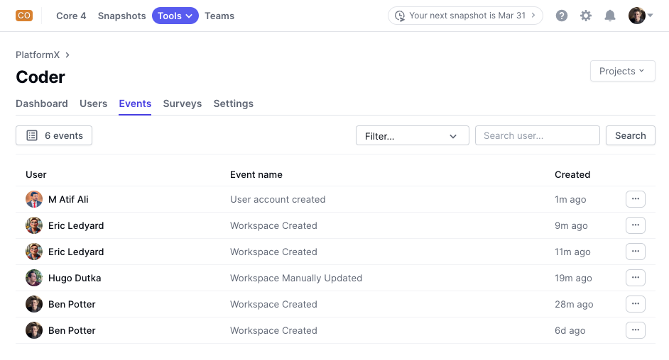
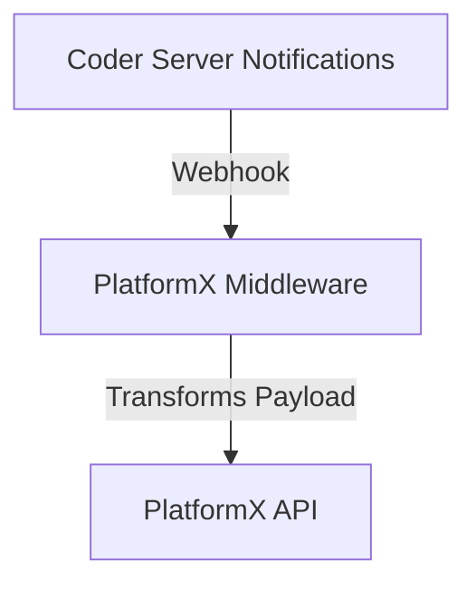

# Coder PlatformX Events Middleware

## Overview

This sample middleware transforms Coder notification payloads into PlatformX-compatible payloads and forwards them to [PlatformX by getDX](https://getdx.com/platformx) for tracking. It is optimized for serverless platforms such as AWS Lambda and Google Cloud Run but may require modifications to fit your organization's needs.



> [!NOTE]
> This repository is a sample implementation. Adaptations in other languages and frameworks are possible.

## How It Works

Coder sends [notifications](https://coder.com/docs/admin/monitoring/notifications) via webhooks to this middleware, which processes and reformats the payload into a structure compatible with [PlatformX by getDX](https://help.getdx.com/en/articles/7880779-getting-started). The transformed payload is then forwarded to PlatformX for further processing and analysis.



## Supported Notification Types

This middleware supports the following [Coder notifications](https://coder.com/docs/admin/monitoring/notifications):

- Workspace Created
- Workspace Manually Updated
- User Account Created
- User Account Suspended
- User Account Activated

## Deployment

This middleware is optimized for serverless environments such as Google Cloud Run and AWS Lambda. If using Docker as a fallback:

```sh
git clone <repo-url>
cd <repo-directory>
docker build -t coder-platformx-events-middleware .
docker run -p 8080:8080 --env-file .env coder-platformx-events-middleware
```

## Environment Variables

Create a `.env` file in the project root and set the following variables. A `.env.sample` file is included with all supported notifications tracked.

| Variable       | Description                            | Example                                  |
| -------------- | -------------------------------------- | ---------------------------------------- |
| LOG_LEVEL      | Logging level (DEBUG, INFO, WARNING)   | INFO                                     |
| GETDX_API_KEY  | API key for PlatformX                  | your-api-key                             |
| EVENTS_TRACKED | Comma-separated list of tracked events | Workspace Created,User Account Suspended |

## Usage with Coder Server

To configure Coder to send notifications to this middleware, set the following environment variables for your Coder server:

```sh
export CODER_NOTIFICATIONS_WEBHOOK_ENDPOINT=<your-deployed-app-url>
export CODER_NOTIFICATIONS_METHOD=webhook
```

Replace `<your-deployed-app-url>` with the actual URL where this middleware is hosted.

## API Endpoints

- `GET /` - Health check endpoint
- `POST /` - Webhook receiver

## Logging

Logs are printed to the console and can be adjusted using the `LOG_LEVEL` variable. The available levels are:

| Level   | Description                           |
| ------- | ------------------------------------- |
| DEBUG   | Most verbose, useful for debugging    |
| INFO    | Standard logging for normal operation |
| WARNING | Logs only warnings and errors         |

## Development

This application was written in Python 3.11.x.

1. Clone the repository:
   ```sh
   git clone <repo-url>
   cd <repo-directory>
   ```
2. Install dependencies:

   ```sh
   pip install -r requirements.txt
   ```

3. Start the Flask development server:
   ```sh
   python3 main.py
   ```
